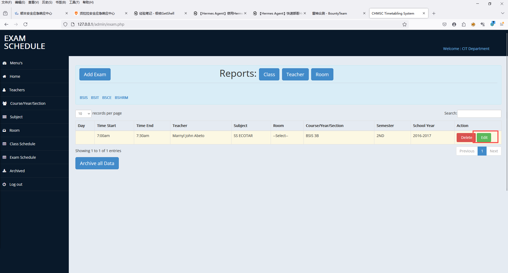
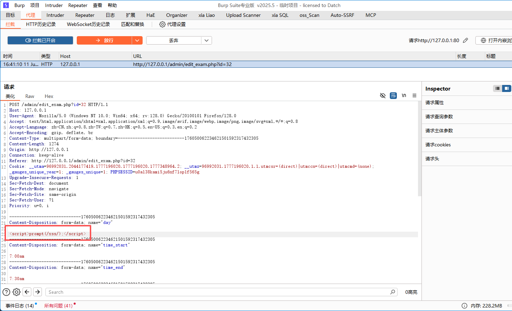
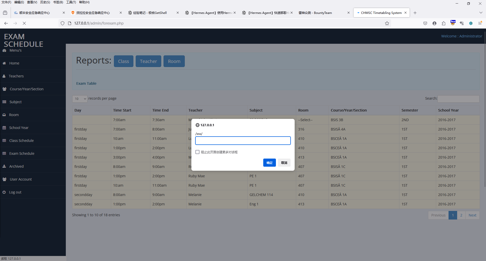

# CVE-2026-16156

- 来源仓库：[justconter/cve](https://github.com/justconter/cve)
- Issue：[#3](https://github.com/justconter/cve/issues/3)
- 原始标题：sourcecodester  Class and Exam Timetabling System Project V1.0 /forexam.php cross site scripting

# sourcecodester  Class and Exam Timetabling System Project V1.0 /forexam.php cross site scripting

# Email OF AFFECTED PRODUCT(S)

# . Class and Exam Timetabling System

## Vendor Homepage

- sourcecodester

## submitter

-  Vulnerable File

-  justconter

## VERSION(S)

- V1.0

## Software Link

https://www.sourcecodester.com/download-code?nid=11332&title=Class+and+Exam+Timetabling+System+in+PHP+with+Source+Code

## Vulnerability Type

- XSS

## Root Cause

- An XSS vulnerability was found in the '/forexam.php' file of the 'Class and Exam Timetabling System' project. The reason for this issue is that attackers inject malicious script code from the parameter 'day' and the system outputs the user input directly to the web page without appropriate encoding or filtering. This allows attackers to execute arbitrary script code in the victim's browser, thereby performing unauthorized operations.
  Impact
- Attackers can exploit this XSS vulnerability to steal cookies, session tokens, or other sensitive information of the victim, perform actions on behalf of the victim, deface web pages, redirect users to malicious websites, and even gain control of the victim's browser, posing a serious threat to user privacy and system security.
  EmailRIPTION
- During the security review of "Class and Exam Timetabling System", I discovered a critical XSS vulnerability in the "/forexam.php" file. This vulnerability stems from insufficient user input validation and output encoding of the 'day' parameter, allowing attackers to inject malicious script code. Therefore, attackers can execute arbitrary scripts in the victim's browser, steal sensitive information, and perform operations on behalf of the victim. Immediate remedial measures are needed to ensure system security and protect user data.

## No login or authorization is required to exploit this vulnerability

## Vulnerability details and POC

## Vulnerability location:

- 'day' parameter

## Payload:

<script>prompt(/xss/);</script>

## The following are screenshots of some specific information obtained from testing and running with the relevant tool:

```
http://127.0.0.1/admin/forexam.php
```

first，edit the exam



insert xss payload





## Suggested repair

1.Output encoding:
Encode user input when outputting it to the web page. Different contexts (such as HTML, JavaScript, CSS, URL) require different encoding methods to ensure that the input is treated as pure text and not executed as code.

2.Input validation and filtering:
Strictly validate and filter user input data. Only allow input that conforms to the expected format and reject or escape any potentially malicious content, such as script tags, event handlers, etc.

3.Use Content Security Policy (CSP):
Implement a strict CSP to restrict the sources of scripts that can be executed on the web page, preventing the execution of unauthoriczed inline scripts and external scripts.

4.Set secure and HttpOnly flags for cookies:
For sensitive cookies (such as session cookies), set the HttpOnly flag to prevent access via JavaScript, and set the Secure flag to ensure they are only transmitted over HTTPS, reducing the risk of cookie theft.

5.Regular security audits:
Regularly conduct code and system security audits to promptly identify and fix potential XSS vulnerabilities and other security issues.
